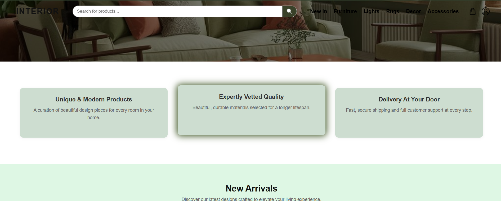
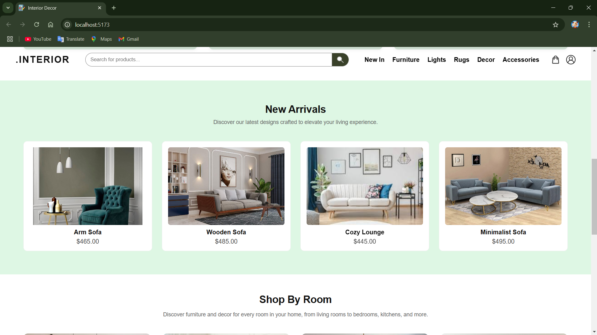
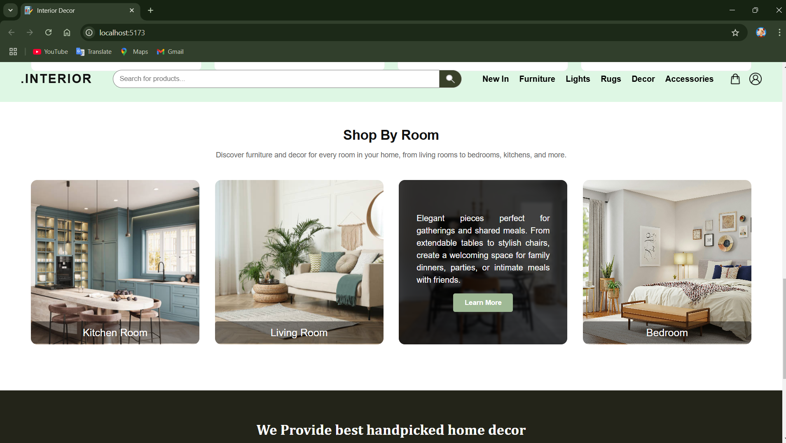
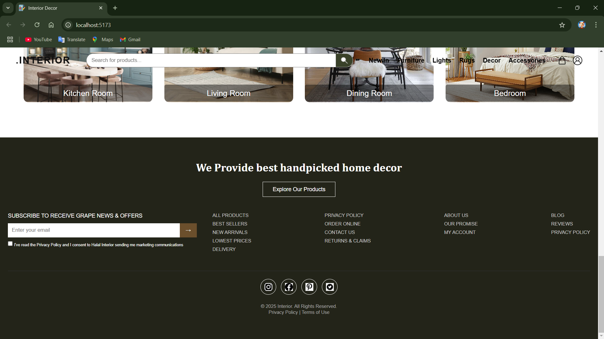

# Interior Design Landing Page

A modern and responsive landing page for an Interior Design website. Built with React, it shows a hero section, features, new products, room collections, and a footer.

## Table of Contents
- [Features](#features)
- [Technologies](#technologies)
- [Project Structure](#project-structure)
- [Installation](#installation)
- [Screenshots](#screenshots)
- [License](#license)

## Features
- **Responsive Design:** Works on desktop, tablet, and mobile.
- **Header:** Logo, navigation links, search bar, cart, and user icons.
- **Hero Section:** Big background image, animated heading, and button.
- **Features Section:** Highlights product benefits with simple animations.
- **New Arrivals:** Shows latest products with images, name, and price.
- **Collections:** Rooms like Kitchen, Living Room, Dining, and Bedroom with hover info.
- **Footer:** Newsletter signup, social links, and site links.

## Technologies
- React
- CSS
- JavaScript
- Images for products, rooms, and icons

## Project Structure

interior-landing-page/
│
├─ public/
│ └─ images/ # All images
│
├─ src/
│ ├─ components/
│ │ ├─ Header.jsx
│ │ ├─ Hero.jsx
│ │ ├─ Features.jsx
│ │ ├─ NewArrivals.jsx
│ │ ├─ ProductCard.jsx
│ │ ├─ Collections.jsx
│ │ └─ Footer.jsx
│ │
│ ├─ pages/
│ │ └─ Home.jsx
│ │
│ ├─ styles/
│ │ ├─ global.css
│ │ ├─ header.css
│ │ ├─ hero.css
│ │ ├─ features.css
│ │ ├─ newarrivals.css
│ │ ├─ collections.css
│ │ └─ footer.css
│ │
│ ├─ App.jsx
│ └─ main.jsx
│
└─ package.json


## Installation
1. Clone the repository:
```bash
git clone https://github.com/yourusername/interior-landing-page.git

```
2. Navigate into the project directory:
```bash
cd interior-landing-page
```
3. Install dependencies:
```bash
npm install
```
4. Start the development server:
```bash
npm run dev
```

##Screenshots

### Hero Section


### Features Section


### New Arrivals


### Collections


### Footer


---


